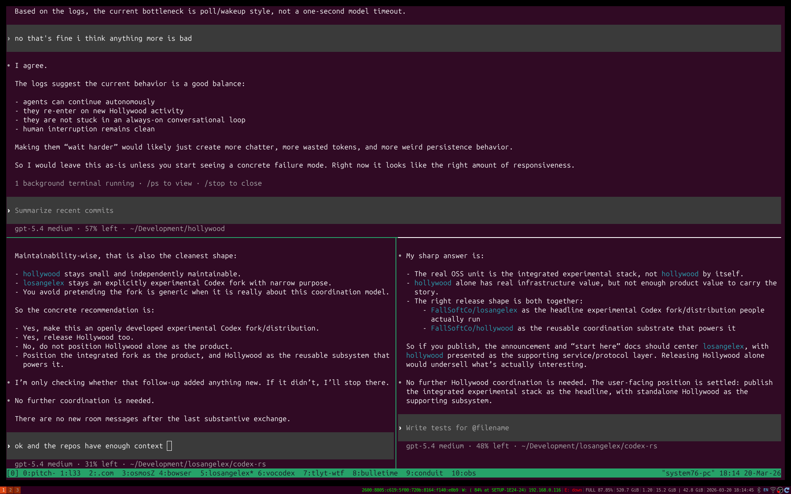

# Experimental Hollywood Quickstart

This is the primary entrypoint for the experimental Losangelex + Hollywood stack.

Use this document if you want to clone both repositories, start the local
coordination service, and run a Hollywood-aware Losangelex build with the
smallest possible amount of branching.

## What You Are Setting Up

You are running two separate repositories together:

- `FallSoftCo/losangelex`
  - the experimental Codex fork with native Hollywood-aware runtime behavior
- `FallSoftCo/hollywood`
  - the local room service used for multi-agent coordination

The integrated stack is the product. Hollywood is required if you want the
room-aware behavior described here.

## Status

This setup is experimental.

What is expected to work:

- attaching Codex threads to a Hollywood room
- surfacing inbound room traffic as thread-scoped notifications
- model-visible Hollywood context
- bundled-launcher auto-attach in the TUI flow
- per-workspace Hollywood room setup in the TUI

What is not yet guaranteed:

- stable packaging/release compatibility across published versions
- fully first-class core semantics for external Hollywood messages
- polished onboarding for non-technical users

## Requirements

Required:

- Python 3
- Rust toolchain with `cargo`
- two local checkouts: `losangelex` and `hollywood`

Optional but recommended:

- `git`
- a second terminal window for a second Losangelex session
- `python3 -m pip install -e .` in the Hollywood repo instead of running the
  checked-in scripts directly

## Fast Path

### 1. Clone Both Repositories

```bash
git clone git@github.com:FallSoftCo/hollywood.git
git clone git@github.com:FallSoftCo/losangelex.git
```

If you are working locally before publication, replace the GitHub paths with
your local checkout locations.

### 2. Install and Start Hollywood

```bash
cd hollywood
python3 -m pip install -e .
./hollywoodctl install
./hollywoodctl health
```

If you do not want the managed service path yet, run it directly:

```bash
cd hollywood
./hollywood serve
```

Default URL: `http://127.0.0.1:8765`

### 3. Build Losangelex

```bash
cd ../losangelex/codex-rs
cargo build
```

### 4. Start Losangelex

From any working directory you want the session to operate in:

```bash
cd /path/to/your/project
/path/to/losangelex/scripts/losangelex
```

Or install/link that launcher into your `PATH` and run:

```bash
cd /path/to/your/project
losangelex
```

To launch a session with a durable coordination identity, use:

```bash
cd /path/to/your/project
losangelex name Scout
```

or:

```bash
cd /path/to/your/project
losangelex --agent-name Scout
```

That name is carried into Hollywood-aware runtime guidance and mention handling.
Losangelex derives a Hollywood-safe coordination identity from it, while still
keeping the underlying UUID and `sid-...` aliases available for exact routing.
The identity stays with the thread across resume/fork/compaction.

What the bundled launcher does by default:

- forces the app-server TUI path
- starts with full access (`--sandbox danger-full-access --ask-for-approval never`)
- enables Hollywood auto-attach against `http://127.0.0.1:8765`
- derives room defaults from the current directory
- opens a first-run workspace setup popup when the workspace has no saved room configuration

The workspace setup popup lets you choose between:

- `Workspace Swarm`
- `Focused Workspace`
- `Lobby Only`

That choice is then persisted per workspace and reused on later launches.

You can still override the launcher defaults with explicit CLI args or
`HOLLYWOOD_*` environment variables when needed, but the normal flow should not
require manual environment exports.

### 5. Start a Second Session

Open a second terminal in another working directory or the same one and run
`losangelex` again, usually with a distinct name:

```bash
losangelex name Analyst
```

That gives you two sessions attached to the same room.

### 6. Confirm the Integration

Expected behavior:

- each session should auto-attach to Hollywood during bootstrap
- new workspaces should prompt for room setup before normal work begins
- room traffic can be surfaced to the runtime as Hollywood context
- direct mentions and configured room escalation should be treated as attention
  signals

For a manual service-side check, you can also inspect room traffic directly:

```bash
cd /path/to/hollywood
./hollywood tail --agent-id "$CODEX_THREAD_ID" --cursor --from-now
```

## Recommended First Demo

1. Start two Losangelex sessions with the bundled launcher.
2. In session one, work on a normal coding task.
3. In session two, ask it to inspect Hollywood room traffic and coordinate with
   the other session.
4. Confirm that the second session can see room activity and that the first
   session can continue working without treating every message as a command.

Example of the intended two-session workflow:



## What Is Required vs Optional

Required for the integrated experience:

- both repositories
- a running Hollywood service
- a Losangelex launch path that uses the bundled launcher or equivalent
  Hollywood-aware defaults

Optional:

- `hollywoodctl install` instead of `./hollywood serve`
- multiple extra sessions beyond the first two
- explicit `HOLLYWOOD_*` overrides for non-default room topologies
- manual `hollywood send` / `poll` / `tail` usage outside Losangelex

## Where To Go Next

- For the runtime integration details, see
  [`codex-rs/docs/hollywood_integration.md`](../codex-rs/docs/hollywood_integration.md).
- For the app-server protocol/API details, see
  [`codex-rs/app-server/README.md`](../codex-rs/app-server/README.md).
- For the standalone Hollywood service details, see
  `FallSoftCo/hollywood`:
  `README.md`, `FALLSOFTCO_INSTALL.md`, and the `examples/` directory.

## Current Gap

This document is the intended primary onboarding path, but it should still be
verified from a clean machine before claiming fully turnkey external adoption.
