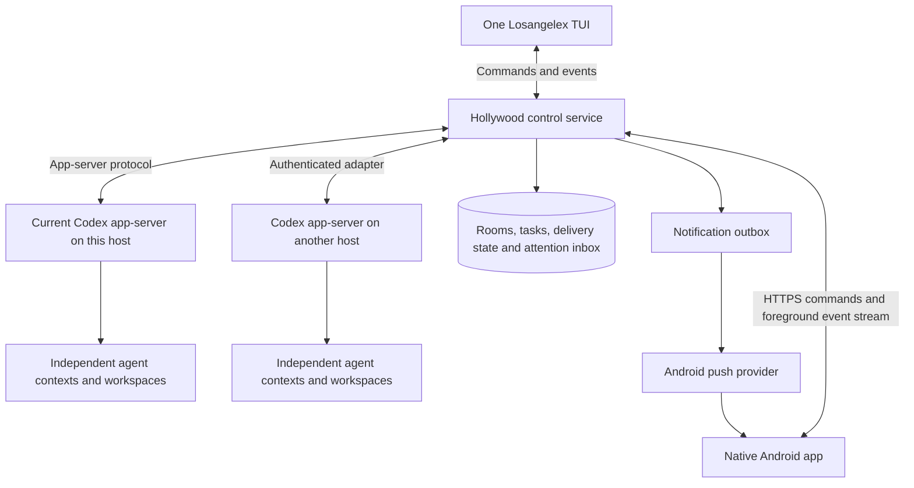

One console for Hollywood teams, with Android access
===================================================

Design proposal, September 10, 2026. This document specifies the next product increment; the console, notification delivery, and Android app described here have not been implemented. The packaged upstream baseline and daily/runtime separation described in [DEVELOPMENT.md](DEVELOPMENT.md) already exist.

The user selected a native Android app with background notifications, support for private and public access, and private access first. Active work defaults to discussing a task with its coordinator, with direct access to every teammate. Project teams persist, while each teammate has a separate conversation for each task. Changes that affect a task automatically produce a brief update to the coordinator; the full direct conversation remains separate. Existing Losangelex and Hollywood implementation can be rewritten as needed. Keep the independent team model and reuse current Codex where it fits.

**Product contract.** One console controls all projects, tasks, and team agents. Each agent keeps its own conversation and context; the user can address it directly. Agents coordinate through Hollywood. The user can close every client and still receive an Android notification when attention is needed. Reopening either client reconstructs the same current work state.

All team agents created or delegated from this console should be Hollywood members. Give each project teammate a stable identity, and map each of its task conversations separately to a runtime ID and independent Codex root thread ID. A teammate can have several task conversations without merging their histories. Display names are editable labels and autocomplete targets, not identity. Configure team delegation through Hollywood tools so a teammate does not silently create parent-owned workers the user cannot address. Native internal helpers remain runtime implementation details; any later product support for native subagents needs explicit visibility and ownership rules.

**Runtime and client architecture.**

Evolve Hollywood into a modular service containing its coordination store, Codex adapter, client API, event projection, and notification dispatcher. Start with one process and a local transactional database. Its modules can be separated later if operational evidence warrants that. Keep its database separate from Codex's migrations and keep database files on the owning host rather than sharing SQLite over a network filesystem.

| Owner | Responsibility |
| --- | --- |
| Codex app-server | Model execution, thread history, tool execution, runtime permissions, actual approval requests and turn lifecycle |
| Hollywood | Team membership, task ownership, room delivery, obligations, claims, stable agent/runtime mapping, client command receipts, attention state and notification delivery |
| TUI and Android | Presentation, drafts, target selection, local cache and explicit user commands |

Hollywood should keep authenticated upstream connections alive independently of any UI. Its adapter consumes typed app-server events and routes authorized commands. Preserve upstream payloads for existing transcript, diff, and tool renderers where useful, while using a versioned Hollywood envelope for runtime and agent identity. The mobile API should expose the actions the product supports instead of forwarding arbitrary app-server RPCs.

Keep human input and peer content distinct. An authenticated user message may enter the addressed root as user input. A peer message uses `turn/start.toolOutput` or `ExternalMessage`, retaining tool authority. Room wake admission remains in Hollywood: optional traffic must not start idle turns simply because the external-input API can do so. UI observation itself must not create model turns.

**The single TUI.** Extend the existing upstream agents overview. Reuse its session switching, per-thread drafts, streaming transcript, diffs, input widgets and approval rendering. Add small modules for Hollywood views and routing; keep central TUI orchestration changes narrow.

| View | What the user sees and does |
| --- | --- |
| Needs you | All unresolved approvals, questions, blockers and failed tasks, ordered by urgency; open the exact agent/task |
| Tasks | Queued, working, waiting, blocked, completed and failed work, with assigned agents and next required action |
| Agents | Every Hollywood team agent, its task, current status, unread count, runtime availability and independent conversation |
| Room | Shared decisions and coordination messages, with links to tasks, artifacts and individual conversations |

Use one selected conversation with a persistent recipient indicator, for example `To: Alex · Backend · Losangelex`. Selecting an agent or autocomplete mention binds the draft to its stable ID. Ambiguous names require selection; they must not silently resolve to the wrong agent. Returning to the overview preserves the draft and scroll position. Room membership never automatically copies one agent's private conversation into another's context.

Make message scope explicit. A direct message goes to one agent's conversation for the selected task. A room post is shared context with defined wake rules. A team assignment creates an owned task and addresses its coordinator by default; it must not fan out the full prompt to every model by accident. Team-wide control actions enumerate their target set and report each result. The coordinator handles planning and integration, while reliable routing and control belong to the service.

After a meaningful task change in a direct conversation, show a concise `Shared with coordinator` entry containing the change and affected work. Include source references and delivery state. Share changes to requirements, interfaces, assignments, blockers and committed decisions; ordinary discussion and full transcripts stay separate. Model-authored briefs remain attributed summaries with tool authority, not new human authorization. The coordinator updates the task plan and informs relevant owners. Surface contradictory decisions for resolution rather than silently overwriting them. Brief extraction and forwarding require model-in-the-loop evaluation against real steering cases.

The [interactive workspace sketch](design/console.html) demonstrates these navigation and sharing choices with fixed sample data. See the [walkthrough](design/README.md) for what to try and what remains undecided. It does not run agents, generate semantic summaries, or send real notifications.

On wide terminals, show the project/team list beside the selected conversation and task details. On narrow terminals, use one full-width view at a time with a compact navigation strip, a persistent Needs-you count, and simple back/navigation actions. All controls must remain reachable without relying on multi-key chords or mouse input. Keep keybindings configurable and preserve upstream composer behavior.

Separate `Pause after this turn` from `Interrupt now`. Pausing prevents further automatic dispatch and goal continuations according to the supported runtime contract; interrupting requests cancellation of current work. Report unsupported or partially successful operations explicitly. Closing the TUI only disconnects that client.

**Native Android experience.** Build a Kotlin/Jetpack Compose client for the same Hollywood API. Use Needs you, Tasks, Agents and Rooms as its main destinations. Tapping an agent opens its conversation; tapping a notification opens the exact attention item with its associated conversation. Support composing, targeting, queueing, interrupting, reading diffs, answering questions, and reviewing approvals with touch-sized controls. Use Android's adaptive list/detail pattern for phone portrait, landscape, tablets and foldables: [official guidance](https://developer.android.com/develop/adaptive-apps/guides/list-detail).

The app should maintain a local cache and drafts, show when state was last synchronized, and reconnect with bounded backoff. Stream updates while foregrounded. Resume using a snapshot plus a durable Hollywood event cursor, rather than assuming a socket preserved every notification. An offline draft is not a submitted command. Mark uncertain submissions as unconfirmed and reconcile their receipt before retrying; never silently replay an old approval or interruption.

Embedding Termux and Mosh would mainly package a terminal session. Mosh synchronizes terminal screen state and keyboard input: [project description](https://mosh.org/). Android still restricts background network activity. Keep Termux/Mosh available for the existing TUI and shell access, while implementing primary mobile control through structured APIs. A terminal shortcut can be added later without making terminal emulation the mobile product's foundation.

A mobile web app remains a viable future client: Web Push can wake a service worker when the page is closed, so native Android is a user preference and interaction choice, not a claim that websites cannot notify. See [Web Push overview](https://web.dev/articles/push-notifications-overview).

**Notifications and the attention inbox.** Notifications originate on the server, even when no TUI or phone app is connected. Store an attention record and notification outbox entry transactionally, with stable IDs and retry state. Persist meaningful state changes; coalesce streaming text for live display rather than journaling every token as an alert.

| Event | Default behavior |
| --- | --- |
| Approval or user answer required | Prompt notification linked to the actionable item |
| Work failed, became blocked, or a required runtime became unavailable | Notify once for the unresolved condition; show current status in the inbox |
| User-requested task completed | Completion notification, grouped by task/project where appropriate |
| Routine commentary, tool output, peer chatter | Live UI updates; no phone alert by default |

Use Firebase Cloud Messaging for the initial Android build assuming compatible Google Play services. Android recommends FCM for background messaging rather than each app keeping its own permanent connection. Use high priority only for time-sensitive, user-visible notifications, and normal priority for routine updates. Respect notification channels, quiet preferences, runtime permission, token rotation and revocation. See [Doze guidance](https://developer.android.com/training/monitoring-device-state/doze-standby), [FCM priorities](https://firebase.google.com/docs/cloud-messaging/android-message-priority), and [FCM Android setup](https://firebase.google.com/docs/cloud-messaging/android/get-started).

Send enough non-sensitive information to display a generic notification without first fetching from the private host, for example `A Losangelex task needs your attention`, plus opaque routing identifiers. Fetch the latest authorized details when opened. Source files, transcripts, credentials and command contents do not need to transit the push provider. Keep the provider behind an interface so a Google-free delivery path can be evaluated if the device requires it.

Push is an alert, not the authoritative record of unresolved work or an authorization channel. Delivery can be delayed or disabled by device state and user settings. On every reconnect, reconcile the durable inbox even if no push arrived. Reading a notification, reading a conversation, answering a question and completing a task are separate states. Completing an action in the TUI resolves it in Android too. Stale notification links show the current resolved state.

Approvals require special care: Codex owns the live request and validates the actual response. Hollywood stores a projection and maps it to the current upstream runtime generation/request. After a disconnect or restart, reconcile available pending requests and reject expired ones; durable storage does not make an old request executable again. The Android approval screen must show the exact target and action before submitting an authenticated response.

An optional interim ntfy adapter can deliver alerts before the native client ships, without changing attention semantics. Its Android delivery differs between hosted Google Play, self-hosted, and F-Droid configurations; do not assume equivalent delivery behavior: [ntfy phone documentation](https://docs.ntfy.sh/subscribe/phone/). No push account, subscription, device registration, or live notification has been configured by this proposal.

**Private access first; public access supported by design.** Start with Tailscale on the host and Android device, and an HTTPS endpoint reachable inside the tailnet. Tailscale Serve supports private HTTPS and tailnet access rules: [Serve documentation](https://tailscale.com/docs/features/tailscale-serve). Keep backend listeners on loopback when relying on its trusted identity headers. Map trusted identity to application authorization for projects and actions. Do not expose raw Codex or legacy Hollywood ports publicly.

The host can send outbound push requests even when its control API is private. The phone receives the notification through its push provider; opening the details requires access to the private host. Display connectivity state when the VPN or host is unavailable.

For public deployment, retain the same client API behind TLS and authenticated application sessions. Use a standard identity provider flow, revocable sessions, and scoped project/action authorization. Runtime adapters receive their own credentials rather than sharing a user's phone credential. Codex provider credentials stay on the runtime host. Public hosting is a deployment option, not a requirement for background push.

The target is a supported host with durable storage and a supervised Codex runtime: this Linux environment first, then tested macOS/Windows or remote Linux hosts. An ephemeral or stopped host cannot keep agents running. Give runtime connections health/heartbeat state and show `unreachable` independently of the last known agent status. Start with one host, but include runtime identity in all mappings so another host does not change the client model.

**Minimal shared API contract to prototype.** The following are proposed Hollywood v2 endpoints, not existing APIs. Keep collection reads paginated and bounded, and generate clients from the versioned schema.

| Endpoint | Contract |
| --- | --- |
| `GET /hollywood/v2/overview` | Authorized snapshot of projects, tasks, agents and attention counts, with a consistent event cursor |
| `GET /hollywood/v2/events?after=...` | Replayable SSE stream; reconnect after a cursor, with explicit resnapshot when retention has expired |
| `GET /hollywood/v2/attention` | Durable unresolved/resolved attention records with pagination |
| `GET /hollywood/v2/agents/{id}/history` | Bounded history through the mapped Codex runtime, preserving item types for rendering |
| `POST /hollywood/v2/commands` | Typed action, explicit target, client command ID and relevant expected state/version; returns a durable receipt |
| `GET /hollywood/v2/commands/{id}` | Reconcile a submitted action after a connection loss |
| `POST /hollywood/v2/devices` | Register or refresh this authenticated client's notification destination; add explicit revocation |

A command receipt distinguishes accepted, dispatched, confirmed, failed and uncertain results. A lost response across the Hollywood/Codex boundary is not proof of failure: reconcile against upstream state before resubmission. Use idempotency and transactional outbox handling where the operation supports them; do not claim exactly-once arbitrary tool effects. A client event cursor and an agent delivery cursor are separate concepts. Retained upstream history and pending-request replay supply recovery evidence, but app-server notifications are not automatically Hollywood's durable event log.

**Implementation sequence and acceptance gates.**

1. Build the smallest shared-service adapter against the pinned upstream package. Create three independent roots in one Hollywood team, expose their mapping and state, and route human and peer input with correct authority. Give every team agent Hollywood delegation tools. Prove direct addressability, isolated contexts and continued execution with no UI connected.
2. Extend the existing agents dashboard into the one-TUI workflow with team membership, an explicit recipient, room/task views and Needs you. Add durable event/attention handling. Validate narrow terminals through the existing Termux/Mosh route as well as a desktop terminal. Include TUI snapshots for new views and interaction tests for draft/target preservation.
3. Deliver the native Android vertical slice: private connection, agent list/conversation, a real server-originated attention notification while the screen is off, notification navigation to that item, and a response that updates the TUI. Configure push only once device/provider setup is available. An interim ntfy delivery adapter is optional.
4. Add richer task actions, diffs, approval handling, device/session management and recovery cases. Test a second remote runtime and authenticated public deployment using the same API. Expand UI breadth after the complete unattended-work/notification/response path passes.

Use deterministic integration tests for durable event ordering, cursor replay, duplicate commands, target identity, authorization, stale approvals, notification retries, and pause/interrupt state transitions. Test Android with its actual background restrictions and permission states: screen off, Doze, process recreation, VPN loss, network handover, notification permission denied, missed pushes and expired deep links. Record observed notification latency and failure rates rather than promising universal instant delivery.

Use actual model runs with frozen Hollywood scenarios for coordination, context selection, unnecessary wakes, correct silence and successful handoffs. Include a user addressing one teammate while others work, a teammate becoming unavailable, and a task finishing while every client is disconnected. These model-dependent claims require the evaluation discipline in the repository instructions.

Keep daily and candidate clients, runtimes and stores independently versioned. Rebuilding a TUI or Android client must not restart the agent host. Host replacement still needs draining and recovery; do not migrate active model requests between binaries. Pin and negotiate the supported Codex protocol version in the adapter so upstream changes are absorbed in one place.

**Inspected upstream starting points.** [Agents overview](../codex-rs/tui/src/app/agents_overview.rs), [overview composer](../codex-rs/tui/src/app/agents_overview_composer.rs), [activity details](../codex-rs/tui/src/app/agents_overview_details.rs), [external input](../sdk/python/docs/api-reference.md#externalmessage), [server requests and notifications](../codex-rs/app-server-protocol/src/protocol/common.rs), [pending request replay](../codex-rs/app-server/src/outgoing_message.rs), and [daemon recovery](../codex-rs/app-server/src/daemon_thread_recovery.rs). The [July-to-September audit](JULY_TO_SEPTEMBER.md) explains which capabilities are already upstream.
