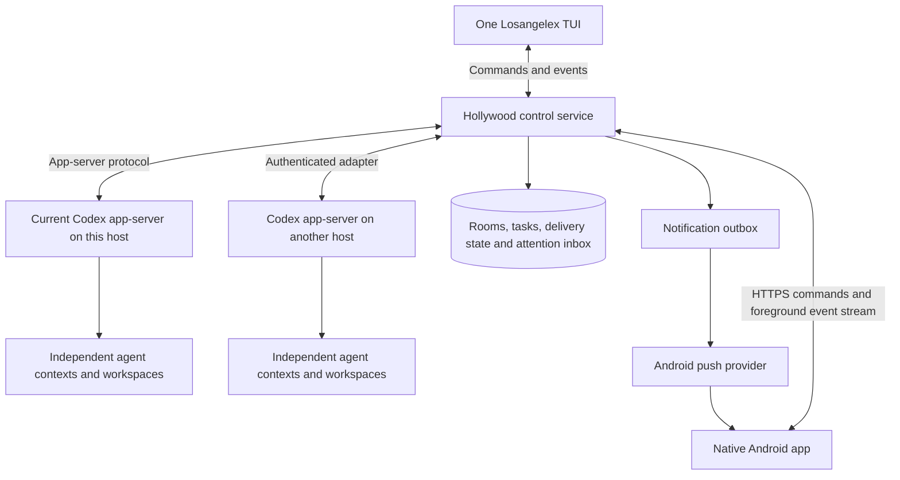

One team room for Hollywood agents, with Android access
======================================================

Design proposal, September 10, 2026. A first implementation now exists: the [shared room](ROOM.md), terminal client, native Android app and background notifications. See [captured evidence](evidence/README.md). This proposal also describes future scope, including cross-project aggregation and configurable teams; those features are not implemented.

The user selected a native Android app with background notifications, support for private and public access, and private access first. Project teams persist, while each teammate has a separate context for each task. The latest direction is conversational control through a shared chat room where the user and every teammate can contribute and address one another. The coordinator remains the default planning partner. For separate direct conversations, changes that affect a task automatically produce a brief update to the coordinator while the full conversation remains separate. Existing Losangelex and Hollywood implementation can be rewritten as needed. Keep the independent team model and reuse current Codex where it fits.

**Product contract.** One conversational workspace controls all projects, tasks, and team agents. The main experience is a shared team room with named participants, a common timeline and one composer. Each agent keeps its own execution context and can speak directly. Agents coordinate through Hollywood. Task, agent and artifact views are available on request; routine work must be possible without navigating among them. The user can close every client and still receive an Android notification when attention is needed. Reopening either client reconstructs the same current work state.

All team agents created or delegated from this console should be Hollywood members. Give each project teammate a stable identity, and map each of its task conversations separately to a runtime ID and independent Codex root thread ID. A teammate can have several task conversations without merging their histories. Display names are editable labels and autocomplete targets, not identity. Configure team delegation through Hollywood tools so a teammate does not silently create parent-owned workers the user cannot address. Native internal helpers remain runtime implementation details; any later product support for native subagents needs explicit visibility and ownership rules.

**Conversational interaction.** Recommend one persistent room per project team, with task threads for focused work. The main room shows discussion and concise task updates; expanding a task reveals its detailed exchange in the same client. The user can start, assign, inspect, redirect, pause and review work through conversation. Requests such as `What needs me across all projects?` return an authorized cross-project summary without copying every project's conversations into a shared model history.

For example, this is a proposed interaction, not an observed model run:

> **You:** Let's get Android notifications working. Maya, handle the app; Theo, the server. Rowan, review the complete flow.
>
> **Coordinator:** I've assigned those tasks. I'll track the interface and bring you decisions that need your input.
>
> **Theo:** Maya, the server can send an opaque attention ID and a generic alert.
>
> **Maya:** That works. I'll fetch the details when the app opens.
>
> **You:** Maya, make sure the lock screen never includes task content.
>
> **Maya:** I'll keep the alert generic. That changes the notification preview tests too.
>
> **Rowan:** I'll check that opening an old notification shows the current task state.

Each agent's message must originate from that agent's execution and carry its authenticated identity. The coordinator may summarize or quote others with attribution, but must not impersonate them. Agents can ask one another questions, report dependencies, challenge a proposal and raise blockers without needing the coordinator to approve each contribution.

| User interaction | Proposed behavior |
| --- | --- |
| A broad request to the room | The coordinator owns the initial response and planning; teammates contribute when relevant to their work |
| `Maya, ...` or an explicit `@Maya` mention | Address Maya in the room; her reply appears under her name in the same timeline |
| Reply to an existing message | Inherit its task and reply target, with both visible in the composer |
| `Maya and Theo, settle the interface` | Create an explicit discussion obligation for those participants; retain decisions against the task |
| `Talk to Maya privately about this` | Open a clearly marked direct conversation; applicable task changes receive the previously selected coordinator brief |
| `What is blocked?`, `Show the diff`, or `Pause Theo's notification task now` | Query authoritative state or invoke a scoped action; show evidence and an action receipt inline |

Room visibility, addressed delivery and permission to wake are separate. A room message is available to its authorized members; that does not mean every model must ingest it immediately or answer it. Addressed requests and task dependencies create tracked obligations. Deliver relevant, bounded room deltas to other participants when they next work. Admit additional turns only for defined obligations or subscribed task events, within budgets. Do not wake the whole team for typing indicators, acknowledgments or routine progress. Being able to contribute must not depend solely on receiving an explicit mention: an agent already working can publish a relevant finding, and a dependency event can require its input.

Keep private working history, tool output and task context independent for each agent. Publish deliberate contributions, useful results, questions and decisions to the room, with expandable evidence. Shared room history remains retrievable with pagination; inject only bounded excerpts and references, preserving source identity and authority. Do not rebuild every agent's context from the entire room transcript on each turn. Keep append-only context and the repository's fragment size/review requirements.

The composer shows the current room, task and addressed participants. Explicit mentions bind stable identities; natural-language addressing resolves names against the current team. Keep a message pending and ask a short in-room clarification when ambiguity would change its recipient, task or action. Replying to a message can make those targets explicit without a menu. A notification reply stays bound to its originating item even if the user has since focused another task. Switching scope must not silently retarget an unsent draft.

Translate conversational control into typed Hollywood commands with actor, targets, expected state and durable receipts. A model's acknowledgment does not prove an assignment, pause or interruption happened. The service validates and executes within the user's authorization, showing confirmed, pending, unsupported or failed results. Preserve a directly accessible interrupt action so stopping work does not depend on coordinator availability. Keep required approval details and responses as inline controls bound to live requests; vague assent in unrelated conversation must not approve them.

**Runtime and client architecture.**

Evolve Hollywood into a modular service containing its coordination store, Codex adapter, client API, event projection, and notification dispatcher. Start with one process and a local transactional database. Its modules can be separated later if operational evidence warrants that. Keep its database separate from Codex's migrations and keep database files on the owning host rather than sharing SQLite over a network filesystem.

| Owner | Responsibility |
| --- | --- |
| Codex app-server | Model execution, thread history, tool execution, runtime permissions, actual approval requests and turn lifecycle |
| Hollywood | Team membership, task ownership, room timeline and delivery, obligations, claims, stable agent/runtime mapping, client command receipts, attention state and notification delivery |
| TUI and Android | Shared conversation, inline artifacts/actions, drafts, visible message scope, local cache and explicit user commands |

Hollywood should keep authenticated upstream connections alive independently of any UI. Its adapter consumes typed app-server events and routes authorized commands. Preserve upstream payloads for existing transcript, diff, and tool renderers where useful, while using a versioned Hollywood envelope for runtime and agent identity. The mobile API should expose the actions the product supports instead of forwarding arbitrary app-server RPCs.

Keep human input and peer content distinct. An authenticated user message may enter the addressed root as user input. A peer message uses `turn/start.toolOutput` or `ExternalMessage`, retaining tool authority. Other agents receiving a room excerpt retain its provenance and intended targets; a quoted user instruction or model summary does not grant new authorization. Room wake admission remains in Hollywood: optional traffic must not start idle turns simply because the external-input API can do so. UI observation itself must not create model turns.

**The single TUI.** Make the shared room and composer the default view. Reuse upstream transcript items, diffs, input widgets, draft handling and approval rendering where they fit; use the existing agents overview as an optional inspector. A shared multi-author room needs its own timeline projection and routing modules rather than treating it as one Codex thread. Keep central TUI orchestration changes narrow.

| Optional view, also reachable through conversation | What the user sees and does |
| --- | --- |
| Needs you | All unresolved approvals, questions, blockers and failed tasks, ordered by urgency; open the exact agent/task |
| Tasks | Queued, working, waiting, blocked, completed and failed work, with assigned agents and next required action |
| Agents | Every Hollywood team agent, its task, current status, unread count, runtime availability and independent conversation |
| Activity | Detailed room/task events and delivery receipts, with links to artifacts and source messages |

Use a persistent scope indicator, for example `Losangelex room · Android notifications · @Maya`. Addressing Maya in a room keeps the message in that room. Entering a direct conversation visibly changes the scope to `Direct · Maya · Android notifications`. Returning from an inspector preserves the draft and scroll position. Room membership never automatically copies one agent's private conversation into another's context.

Make message scope explicit. A direct message goes to one agent's conversation for the selected task. A room post is shared context with defined wake rules and may address specific participants. A team assignment creates owned work; an unaddressed request goes to its coordinator by default. It must not fan out the full prompt to every model by accident. Team-wide control actions enumerate their target set and report each result. The coordinator handles planning and integration, while reliable routing and control belong to the service.

After a meaningful task change in a direct conversation, show a concise `Shared with coordinator` entry containing the change and affected work. Include source references and delivery state. Share changes to requirements, interfaces, assignments, blockers and committed decisions; ordinary discussion and full transcripts stay separate. For changes already stated in the room, track delivery of the source message and update the task record without posting a duplicate recap after every exchange. Model-authored briefs remain attributed summaries with tool authority, not new human authorization. The coordinator updates the task plan and informs relevant owners. Surface contradictory decisions for resolution rather than silently overwriting them. Brief extraction and forwarding require model-in-the-loop evaluation against real steering cases.

The earlier [interactive workspace sketch](design/console.html) explores agent/task navigation and direct-conversation sharing with fixed sample data. Its navigation-led default predates the shared-room direction and is not the proposed primary experience. See the [walkthrough](design/README.md) for its remaining uses. It does not run agents, generate semantic summaries, or send real notifications.

On wide terminals, allow task or agent details beside the room. On narrow terminals, give the room the full width with a compact scope indicator and persistent Needs-you count; expand details only when requested. Keep participant names and task references legible when messages interleave, and preserve reply links. Coalesce progress updates and expand raw tool logs on demand. All controls must remain reachable without relying on multi-key chords or mouse input. Keep keybindings configurable and preserve upstream composer behavior.

Separate `Pause after this turn` from `Interrupt now`. Pausing prevents further automatic dispatch and goal continuations according to the supported runtime contract; interrupting requests cancellation of current work. Report unsupported or partially successful operations explicitly. Closing the TUI only disconnects that client.

**Native Android experience.** Build a Kotlin/Jetpack Compose client for the same Hollywood API. Open to the shared room with one composer; make Needs you, Tasks and Agents optional drawers or sheets. Tapping a participant can insert a mention or explicitly open a direct conversation. Tapping a notification opens its exact attention item and associated room/task or direct conversation, with a reply composer already bound to that item. Support composing, targeting, queueing, interrupting, reading diffs, answering questions, and reviewing approvals with touch-sized inline controls. Use Android's adaptive list/detail pattern for optional inspectors on phones, tablets and foldables: [official guidance](https://developer.android.com/develop/adaptive-apps/guides/list-detail).

The app should maintain a local cache and drafts, show when state was last synchronized, and reconnect with bounded backoff. Stream updates while foregrounded. Resume using a snapshot plus a durable Hollywood event cursor, rather than assuming a socket preserved every notification. An offline draft is not a submitted command. Mark uncertain submissions as unconfirmed and reconcile their receipt before retrying; never silently replay an old approval or interruption.

Embedding Termux and Mosh would mainly package a terminal session. Mosh synchronizes terminal screen state and keyboard input: [project description](https://mosh.org/). Android still restricts background network activity. Keep Termux/Mosh available for the existing TUI and shell access, while implementing primary mobile control through structured APIs. A terminal shortcut can be added later without making terminal emulation the mobile product's foundation.

A mobile web app remains a viable future client: Web Push can wake a service worker when the page is closed, so native Android is a user preference and interaction choice, not a claim that websites cannot notify. See [Web Push overview](https://web.dev/articles/push-notifications-overview).

**Notifications and the attention inbox.** Notifications originate on the server, even when no TUI or phone app is connected. Store an attention record and notification outbox entry transactionally, with stable IDs and retry state. Persist meaningful state changes; coalesce streaming text for live display rather than journaling every token as an alert.

| Event | Default behavior |
| --- | --- |
| Approval or user answer required | Prompt notification linked to the actionable item |
| Work failed, became blocked, or a required runtime became unavailable | Notify once for the unresolved condition; show current status in the inbox |
| User-requested task completed | Completion notification, grouped by task/project where appropriate |
| Routine commentary, tool output, peer chatter | Live UI updates; no phone alert by default |

Use Firebase Cloud Messaging for the initial Android build assuming compatible Google Play services. Android recommends FCM for background messaging rather than each app keeping its own permanent connection. Use high priority only for time-sensitive, user-visible notifications, and normal priority for routine updates. Respect notification channels, quiet preferences, runtime permission, token rotation and revocation. See [Doze guidance](https://developer.android.com/training/monitoring-device-state/doze-standby), [FCM priorities](https://firebase.google.com/docs/cloud-messaging/android-message-priority), and [FCM Android setup](https://firebase.google.com/docs/cloud-messaging/android/get-started).

Send enough non-sensitive information to display a generic notification without first fetching from the private host, for example `A Losangelex task needs your attention`, plus opaque routing identifiers. Fetch the latest authorized details when opened. Source files, transcripts, credentials and command contents do not need to transit the push provider. Keep the provider behind an interface so a Google-free delivery path can be evaluated if the device requires it.

Push is an alert, not the authoritative record of unresolved work or an authorization channel. Delivery can be delayed or disabled by device state and user settings. On every reconnect, reconcile the durable inbox even if no push arrived. Reading a notification, reading a conversation, answering a question and completing a task are separate states. Completing an action in the TUI resolves it in Android too. Stale notification links show the current resolved state.

Approvals require special care: Codex owns the live request and validates the actual response. Hollywood stores a projection and maps it to the current upstream runtime generation/request. After a disconnect or restart, reconcile available pending requests and reject expired ones; durable storage does not make an old request executable again. The Android approval screen must show the exact target and action before submitting an authenticated response.

An optional interim ntfy adapter can deliver alerts before the native client ships, without changing attention semantics. Its Android delivery differs between hosted Google Play, self-hosted, and F-Droid configurations; do not assume equivalent delivery behavior: [ntfy phone documentation](https://docs.ntfy.sh/subscribe/phone/). No push account, subscription, device registration, or live notification has been configured by this proposal.

**Private access first; public access supported by design.** Start with Tailscale on the host and Android device, and an HTTPS endpoint reachable inside the tailnet. Tailscale Serve supports private HTTPS and tailnet access rules: [Serve documentation](https://tailscale.com/docs/features/tailscale-serve). Keep backend listeners on loopback when relying on its trusted identity headers. Map trusted identity to application authorization for projects and actions. Do not expose raw Codex or legacy Hollywood ports publicly.

The host can send outbound push requests even when its control API is private. The phone receives the notification through its push provider; opening the details requires access to the private host. Display connectivity state when the VPN or host is unavailable.

For public deployment, retain the same client API behind TLS and authenticated application sessions. Use a standard identity provider flow, revocable sessions, and scoped project/action authorization. Runtime adapters receive their own credentials rather than sharing a user's phone credential. Codex provider credentials stay on the runtime host. Public hosting is a deployment option, not a requirement for background push.

The target is a supported host with durable storage and a supervised Codex runtime: this Linux environment first, then tested macOS/Windows or remote Linux hosts. An ephemeral or stopped host cannot keep agents running. Give runtime connections health/heartbeat state and show `unreachable` independently of the last known agent status. Start with one host, but include runtime identity in all mappings so another host does not change the client model.

**Minimal shared API contract to prototype.** The following are proposed Hollywood v2 endpoints, not existing APIs. Keep collection reads paginated and bounded, and generate clients from the versioned schema.

| Endpoint | Contract |
| --- | --- |
| `GET /hollywood/v2/overview` | Authorized snapshot of projects, tasks, agents and attention counts, with a consistent event cursor |
| `GET /hollywood/v2/events?after=...` | Replayable SSE stream; reconnect after a cursor, with explicit resnapshot when retention has expired |
| `GET /hollywood/v2/attention` | Durable unresolved/resolved attention records with pagination |
| `GET /hollywood/v2/rooms/{id}/messages` | Paginated shared timeline with authenticated authors, task/reply references, addressed participants and delivery state |
| `GET /hollywood/v2/agents/{id}/history` | Bounded history through the mapped Codex runtime, preserving item types for rendering |
| `POST /hollywood/v2/commands` | Typed action, explicit target, client command ID and relevant expected state/version; returns a durable receipt |
| `GET /hollywood/v2/commands/{id}` | Reconcile a submitted action after a connection loss |
| `POST /hollywood/v2/devices` | Register or refresh this authenticated client's notification destination; add explicit revocation |

A command receipt distinguishes accepted, dispatched, confirmed, failed and uncertain results. A lost response across the Hollywood/Codex boundary is not proof of failure: reconcile against upstream state before resubmission. Use idempotency and transactional outbox handling where the operation supports them; do not claim exactly-once arbitrary tool effects. A client event cursor and an agent delivery cursor are separate concepts. Retained upstream history and pending-request replay supply recovery evidence, but app-server notifications are not automatically Hollywood's durable event log.

Room posts use the command path and retain the original human text. Address resolution and any derived task/control actions refer back to that message and have separately reconcilable state. Persist human messages before model interpretation; an unavailable coordinator must not lose input or block an explicit direct address. History reads must accept an explicit task/conversation identity when one teammate has multiple contexts. A room message being stored, delivered to a runtime and answered are distinct states; avoid human-style read receipts that imply an agent understood content merely because it was fetched.

**Implementation sequence and acceptance gates.**

1. Build the smallest shared-service adapter against the pinned upstream package. Create three independent roots in one Hollywood team, expose their mapping and state, and route human and peer input with correct authority. Give every team agent Hollywood delegation tools. Prove direct addressability, isolated contexts and continued execution with no UI connected. Evaluate actual-model participation in frozen room scenarios before treating the conversational design as established behavior.
2. Build the one-TUI shared-room workflow with named authors, reply/task references, direct addressing, conversational assignment and status, optional inspectors and Needs you. Add durable event/attention handling. Validate narrow terminals through the existing Termux/Mosh route as well as a desktop terminal. Include TUI snapshots for new views and interaction tests for draft/target preservation. Complete a task involving three agents without requiring the user to switch individual conversations.
3. Deliver the native Android vertical slice: private connection, shared room and addressed replies, a real server-originated attention notification while the screen is off, notification navigation to that item, and a response that updates the TUI. Configure push only once device/provider setup is available. An interim ntfy delivery adapter is optional.
4. Add richer task actions, diffs, approval handling, device/session management and recovery cases. Test a second remote runtime and authenticated public deployment using the same API. Expand UI breadth after the complete unattended-work/notification/response path passes.

Use deterministic integration tests for durable event ordering, cursor replay, duplicate commands, target identity, authorization, stale approvals, notification retries, and pause/interrupt state transitions. Test Android with its actual background restrictions and permission states: screen off, Doze, process recreation, VPN loss, network handover, notification permission denied, missed pushes and expired deep links. Record observed notification latency and failure rates rather than promising universal instant delivery.

Use actual model runs with frozen Hollywood scenarios for coordination, context selection, unnecessary wakes, correct silence and successful handoffs. Include a user addressing one teammate while others work, useful unprompted contributions, conflicting proposals, duplicate replies, conversation loops, ambiguous names, interleaved tasks, private-to-coordinator briefs, a teammate becoming unavailable, and a task finishing while every client is disconnected. Compare completed work, missed obligations, user clarification/navigation effort, chatter, latency and token cost under equal budgets. These model-dependent claims require the evaluation discipline in the repository instructions; the sample dialogue and deterministic routing checks are not proof of useful team behavior.

Keep daily and candidate clients, runtimes and stores independently versioned. Rebuilding a TUI or Android client must not restart the agent host. Host replacement still needs draining and recovery; do not migrate active model requests between binaries. Pin and negotiate the supported Codex protocol version in the adapter so upstream changes are absorbed in one place.

**Inspected upstream starting points.** [Agents overview](../codex-rs/tui/src/app/agents_overview.rs), [overview composer](../codex-rs/tui/src/app/agents_overview_composer.rs), [activity details](../codex-rs/tui/src/app/agents_overview_details.rs), [external input](../sdk/python/docs/api-reference.md#externalmessage), [server requests and notifications](../codex-rs/app-server-protocol/src/protocol/common.rs), [pending request replay](../codex-rs/app-server/src/outgoing_message.rs), and [daemon recovery](../codex-rs/app-server/src/daemon_thread_recovery.rs). The [July-to-September audit](JULY_TO_SEPTEMBER.md) explains which capabilities are already upstream.
