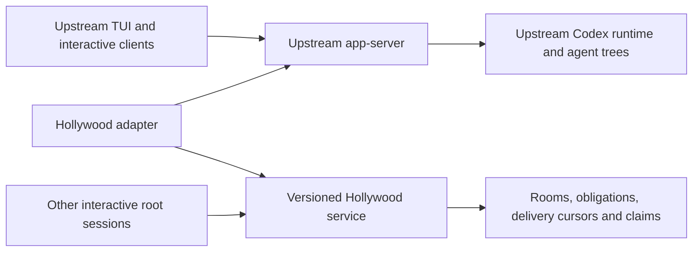

Losangelex renewal investigation, 2026-09-10
=========================================

Build the next Losangelex from current upstream Codex, carrying forward a small Hollywood integration. Losangelex already uses app-server; this is an upstream refresh and reduction of duplicated functionality. Keep the existing runtime installed separately while developing that replacement. The goal is better delivery of real team tasks at a measured latency and token budget.

**Verified baseline.** The original fork is `468b24abd9549dece2e7a92e6353ea4d4bc43778`, dated July 23. Its upstream merge base is `44d76c6a6dd04fa2efc302b906ac8774267a1272`. The new `losangelex-next` branch starts directly at upstream `f8ab57359dde6b6d5de1aee613c18fe60b661aeb`, dated September 10. Hollywood local and remote `main` both point at `54bca57317bc3c949b8bd35fde5f1dca6284f640`, dated April 29. The installed legacy executable reports `codex-cli 0.139.0`; its build commit is unknown, so it must not be represented as a build of the July 23 source.

| Comparison from the merge base | Result |
| --- | ---: |
| Fork-only commits | 184 |
| Upstream-only commits | 2,074 |
| Files changed by the fork | 469 |
| Files changed by upstream | 4,606 |
| Files changed on both sides | 200 |
| Paths with merge conflicts in a trial merge | 109 |
| Fork Rust source delta, including tests | 208 files; +33,776 / -427 lines |

The apparent total fork delta is +368,931 / -712 lines, but 307,682 added lines are under `evals/` and `tmp/`. Carrying that entire tree into the new implementation would obscure the product changes. Preserve historical research as evidence in the legacy branch and transfer selected fixtures and runners deliberately. The [machine-readable summary](audit-2026-09-10/diff-summary.json) and [conflict paths](audit-2026-09-10/merge-conflicts.txt) record the comparison. `git merge-tree --write-tree --name-only` produced the conflict assessment without merging either working tree.

**What current Codex already supplies.** These are source-level findings at the pinned upstream commit; optional features still need explicit configuration and product testing. This inventory includes features already present in July. The [dated July-to-September comparison](JULY_TO_SEPTEMBER.md) distinguishes those from subsequent additions. July's upstream base already included v2 collaboration tools, agent mailboxes, durable sleep wakeups, and extension interfaces.

| Capability | Upstream evidence | Porting decision |
| --- | --- | --- |
| Agent messaging with separate queue-only and wake behavior | [v2 message handler](../codex-rs/core/src/tools/handlers/multi_agents_v2/message_tool.rs) | Reuse within each agent tree. Preserve the distinction between messages and obligations. |
| Root-scoped agent identity, execution limits, and residency | [AgentControl](../codex-rs/core/src/agent/control.rs) | Keep upstream ownership. Hollywood connects independently controlled root sessions. |
| Interactive management of independent root sessions | [agents dashboard](../codex-rs/tui/src/app/agents_overview.rs) | Reuse `codex agents` for task launch, switching, and background activity. Independent interactive sessions alone no longer distinguish Losangelex. |
| Durable user-input queue and idle dispatch | [queue extension](../codex-rs/ext/queue/src/service.rs) | Reuse admission/lifecycle patterns. Its user-only queue is not automatically a typed peer-message inbox. |
| External messages that start or join a turn with tool authority | [Python SDK ExternalMessage](../sdk/python/docs/api-reference.md#externalmessage), [turn protocol](../codex-rs/app-server-protocol/src/protocol/v2/turn.rs) | Assess the public `turn/start.toolOutput` boundary before adding native integration code. Keep room wake admission and durable delivery in Hollywood. |
| Typed contextual input, tools, and thread/turn lifecycle contributions | [extension interfaces](../codex-rs/ext/extension-api/src/contributors.rs) | Use a small extension crate only for required behavior the public API cannot provide. |
| Remote TUI, streamed events, history, approvals, and authentication | [official app-server documentation](https://learn.chatgpt.com/docs/app-server) | Keep the upstream client/server protocol and rendering wherever possible. |
| Managed daemon lifecycle and package assembly | [daemon](../codex-rs/app-server-daemon/README.md), [package builder](../scripts/codex_package/README.md) | Use packaged binaries and explicit lifecycle operations. Avoid launch-time compilation. |
| Automatic TUI reconnection and managed daemon thread recovery | [daemon recovery](../codex-rs/app-server/src/daemon_thread_recovery.rs), [restart integration tests](../codex-rs/app-server/tests/suite/v2/daemon_update_recovery.rs) | Reuse upstream recovery. Test forced shutdown and delivery recovery separately; cold resume does not preserve an in-flight process. |
| Model catalog, tools, plugins, permissions, and context improvements | Current upstream tree | Inherit them from upstream; avoid copying old fork overrides wholesale. |

`multi_agent` defaults to enabled; `multi_agent_v2` is marked stable but defaults to disabled in the [feature registry](../codex-rs/features/src/lib.rs). Benchmark both the default product and a correctly configured native v2 baseline. Upstream `AgentControl` documents a registry scoped to one root's tree. Cross-root Hollywood rooms remain a distinct product capability.

The extension interfaces are internal Rust interfaces, not a stable third-party binary plugin ABI. First assess a Hollywood service adapter using public app-server input and event APIs, with MCP tools for coordination. MCP alone does not establish delivery or idle wake, but `turn/start.toolOutput` now supplies an explicit external-message path. Add source integration only where the required behavior cannot be expressed through those APIs. In particular, optional room traffic must not wake an idle thread merely because this API can start one.

**Development interruption diagnosis and mitigation.** The legacy launcher invoked `cargo +stable build` on every ordinary start, used mutable `target/.../debug/codex`, and loaded launcher code from the working checkout. The local Hollywood service also started directly from its development checkout. These coupled daily use to development.

The launcher fix makes compilation opt-in with `LOSANGELEX_AUTO_BUILD=1`, resolves its directory relative to the installed script, and gives each client its own restart handoff file by default. [pin_legacy.py](pin_legacy.py) copies the executable, launcher, and team helper into a content-addressed release and switches the `stable` link atomically. Its installed wrapper resolves that link once before starting the client or daemon. Earlier releases remain available, and existing processes retain their executable paths. It checks copied content, records hashes, backs up the previous wrapper, and never infers a binary's source commit from the current checkout.

On this machine, `~/.local/bin/losangelex` now selects the pinned legacy installation under `~/.local/share/losangelex/releases/`. Its existing Codex home and Hollywood endpoint remain the daily session state. A live version smoke returned `codex-cli 0.139.0`. Four substrate tests cover source/build removal, installing while an old process runs, failed installation, and repeat installation with wrapper backup. These tests establish packaging behavior, not model behavior or seamless session migration.

Hollywood was installed non-editably from a Git archive of `54bca573...` into its own version directory and virtual environment. An isolated HTTP smoke returned schema `3` and contract `losangelex-room/v2`. The systemd drop-in `~/.config/systemd/user/hollywood.service.d/10-pinned-runtime.conf` selects that installation on the next start. Only `daemon-reload` was issued: the live service remained healthy with PID `4269`. Development in either source checkout no longer changes the code that its next restart will load. Keep the retained source snapshot and environment together.

This separation prevents development builds from replacing daily runtime files. Upstream added automatic TUI reconnect on August 31 and managed daemon recovery of saved persistent root threads on September 9, including goal continuation before a client reconnects. These should replace custom recovery machinery where their contracts fit. Explicitly stopping the daily app-server still interrupts its work. The daemon documentation states that manual updates can interrupt active or queued work; recovery uses cold resume and does not guarantee preservation of an in-flight process or a recovery snapshot after forced termination.

**State migration is the highest-risk port.** The fork changed upstream migration numbering. For example:

| Migration | Legacy fork | Current upstream |
| --- | --- | --- |
| 0035 | Add Hollywood thread state | Drop old memory tables |
| 0044 | Add path claims | Add import-provider IDs |
| 0051 | Add collaborative edit plans | Add thread artifacts |
| 0052 | Add thread names | Add project recency |

There are 18 overlapping version numbers with different filenames through 0054. Both trees' [migration code](../codex-rs/state/src/migrations.rs) permits missing newer versions but still validates known checksums. That setting does not make these databases interchangeable. The existing fork uses `state_7.sqlite` and upstream uses `state_5.sqlite`; read-only inspection confirmed both files under the current Codex home, with their respective migration histories. Their different filenames already separate these main databases, but other home contents remain shared. Avoid renumbering already applied migrations or editing their checksums to force compatibility.

Use a separate Codex home, database, app-server endpoint, and Hollywood database for the replacement. A worktree alone does not isolate runtime state. Keep Hollywood coordination state in a service-owned database with its own migration namespace. Build an explicit importer from a consistent SQLite backup of the old state, preserve source data and original rollouts, and verify IDs, tasks, claims, cursors, and attachments. Test old-rollout resume against copies, including historical events that upstream cannot deserialize. Database rollback means restoring a compatible backup alongside its runtime; selecting an older executable alone is insufficient.

**Recommended architecture.** Keep upstream responsible for each session's execution, approvals, history, model access, and subagent lifecycle. Keep Hollywood responsible for durable coordination across independent sessions.

Prototype addressed external delivery through `turn/start.toolOutput` or the SDK's `ExternalMessage`, which retains tool authority and can start an idle turn or join an active regular turn. Never turn peer text into user authorization. Use upstream events for runtime observation and explicit Hollywood state for room membership and obligations. If native lifecycle or passive-context integration is required, use `TurnInputContributor`, tool contributors, and lifecycle callbacks in a small extension. The public `thread/inject_items` RPC appends history without waking a thread, but exposes raw response items and applies ownership checks; it is not permission to bypass authority boundaries.

Start with the existing HTTP/polling contract. Add persisted delivery IDs, deduplication, transactional obligation/lease transitions, bounded inboxes, backpressure, and auditable ownership where the actual failure fixtures require them. Use at-least-once delivery with idempotent handling, rather than claiming exactly-once effects across a service and app-server. An outbox/inbox transaction and acknowledged cursor make crash recovery reviewable. Introduce event streaming only after measuring polling as a bottleneck; maintain cursor replay and reconnect semantics.

Keep task and claim authority in one Hollywood service-owned store so two independent app-servers agree. Use isolated Git worktrees by default for parallel edits and a designated integration step. Path claims coordinate intent; shell commands and arbitrary editors can bypass an `apply_patch` hook, so claims cannot guarantee filesystem exclusion. Preserve explicit same-file collaboration as an evaluated option.

For context efficiency, send bounded addressed deltas and compact artifact references, retain a stable instruction prefix, and give optional room traffic no authority to start autonomous work. Apply hard per-item and aggregate caps before injection, with pagination outside context. Preserve the repository's manual review gate for any new fragment that can exceed 1,000 tokens. Rate-limit and deduplicate required wakes without dropping obligations. Start with deterministic admission rules and model-in-the-loop evaluation of their behavioral effects.

**Port in reviewable stages.** These are remaining implementation stages, not completed capabilities of the upstream baseline.

1. Freeze daily runtimes; compile and package clean upstream; establish isolated smoke tests. Keep the legacy branch available as a reference and recovery path. This investigation implements the daily-runtime separation and prepares the upstream baseline.
2. Prove two independently interactive roots can join one isolated room through a small Hollywood adapter. Reuse the agents dashboard and assess public app-server external input and event APIs first. Add extension registration only for demonstrated API gaps. Keep schemas versioned; regenerate only generated artifacts from the new source.
3. Add addressed messages and required-obligation delivery, then recovery. Port the July no-op wake failure fixtures first. Add public app-server integration tests and real model runs for optional silence, required wakes, interruption, and handoff. Add TUI snapshots for new roster/attention UI.
4. Move durable coordination tasks, leases, and claims into the separate store. Build and test the legacy importer before bringing existing sessions over. Add optimistic version checks and fencing for expired ownership. Compare default worktrees with explicit same-file coordination.
5. Re-evaluate schedulers, watchers, tester runtimes, identity/auth additions, and collaborative patch extensions independently. Carry forward only product requirements that current upstream does not cover, in changes under the repository's review-size limits.

Avoid wholesale cherry-picks of the old CLI, core handlers, state migrations, prompts, and generated schema bundles. The legacy fork adds over 13,000 lines under core and over 9,000 under state. Some old rollout/restart scaffolding is already disconnected: `hollywood_rollover.rs` allows dead code, and the current legacy TUI has no consumer of `ClientRestartRequested`. Port behaviors proven through the product surface, not just the presence of old files or tests.

**What outperforming Codex should mean.** Existing evidence is mixed. The [June 16 same-model results](https://github.com/FallSoftCo/codex/blob/468b24abd9549dece2e7a92e6353ea4d4bc43778/evals/research/2026-06-16-gpt55-upstream-subagent-messaging/README.md) report:

| Silo workload | Codex subagents | Losangelex | Interpretation |
| --- | --- | --- | --- |
| n=5, 30 tasks | 24 successes; 220.8 s; 161,852 uncached+output tokens/task | 25 successes; 170.9 s; 317,729 tokens/task | Faster, about 1.96x tokens |
| n=10, 30 tasks | 23 successes; 289.4 s; 246,053 tokens/task | 23 successes; 177.6 s; 650,741 tokens/task | Same strict success, faster, about 2.64x tokens |

Those are historical results, not evidence against September Codex. The [July product proof](https://github.com/FallSoftCo/codex/blob/468b24abd9549dece2e7a92e6353ea4d4bc43778/evals/research/2026-07-05-losangelex-product-proof/REPORT.md) establishes selected interactive collaboration and recovery behaviors, while also documenting expensive context usage and previous failure to quiesce.

Freeze representative real fixtures before tuning: multi-file implementation, independent investigations with synthesis, required dependencies, user steering during a teammate's turn, same-file conflicts, restart/resume, and completed rooms that must stay idle. Include simple single-agent tasks as negative controls. Compare clean current Codex, current Codex native agents, the pinned legacy fork, and the new adapter using the same model version, reasoning setting, tools, permissions, fixtures, and token/concurrency budgets. Add full-context controls where applicable.

Score useful accepted code delivery, correctness, duplicated edits/replies, missed obligations, idle wake rate, resume success, p50/p95 wall time, and input/cached/output tokens. Compute actual cost from verified pricing when applicable; token totals alone are not a dollar estimate. Keep answer keys and production side effects outside model runs. Randomize paired run order, retain failures, use repeated model runs, and report paired confidence intervals. Deterministic tests enforce storage and transport invariants; they do not prove that agents cooperate well.

A proposed release target is no material quality regression, plus at least 20% lower time to accepted delivery at matched spend, or 20% lower spend at matched time, on held-out team tasks. Pre-register the quality margin and sample size after a variance pilot. Until that comparison passes, describe this as a capability and maintainability upgrade with an unproven performance hypothesis.

**Release discipline.** Build once using upstream's canonical package builder, including the Code Mode host and platform helpers. Test the installed package, then select it for new sessions. Store source commit, package hashes, toolchain, and compatible state schema versions. Keep daily and candidate runtimes, homes, sockets, ports, and Hollywood stores separate. Reconnect clients without restarting the host when possible; drain work before intentional host replacement. Pin schema/client compatibility for the experimental WebSocket transport described in the [official documentation](https://learn.chatgpt.com/docs/app-server).

Follow upstream frequently on a small integration branch, with a scheduled compatibility build and contract tests. Keep normal permission/approval behavior; audit the legacy launcher's automatic full-access defaults and unrelated environment loading before carrying them into the replacement. Do not turn benchmark-specific foreman/finisher strategies into universal prompts. Push integration updates to both Losangelex remotes and verify matching commit IDs.

**Validation completed for this investigation.** Clean upstream `cargo build --locked --profile dev-small -p codex-cli --bin codex` passed with Rust 1.95.0 in 13m21s. Upstream `just assemble-codex-package` then built the Code Mode host and Linux bwrap helper and assembled a package containing those binaries, Codex, ripgrep, patched zsh, and the package manifest. The candidate's Rust source and dependency locks remain unchanged from the pinned upstream commit.

The legacy executable, fresh upstream executable, and assembled upstream package passed [the disposable app-server smoke](smoke_runtime.py): readiness, thread creation, a client disconnect/reconnect, and reading the original thread. The packaged Code Mode host also passed its executable help check. The four snapshot tests passed, Ruff lint passed, `just fmt` completed, and unrelated formatter changes to upstream's justfile were discarded. No live-model comparison or full workspace test suite was run; no new Rust agent logic was introduced. [Operating instructions](DEVELOPMENT.md) describe the installed commands and how to repeat the isolated checks.
